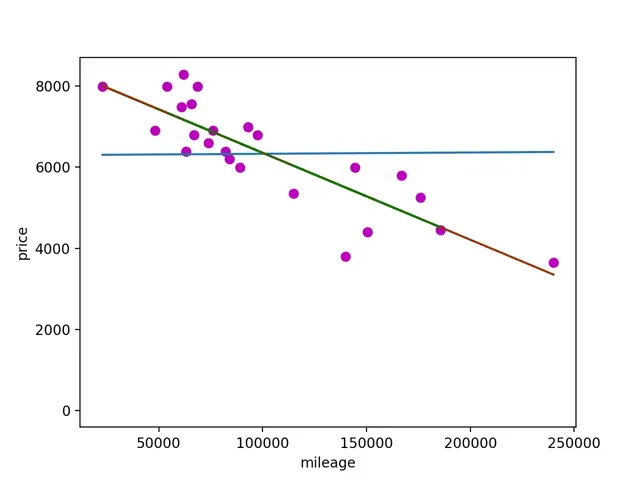
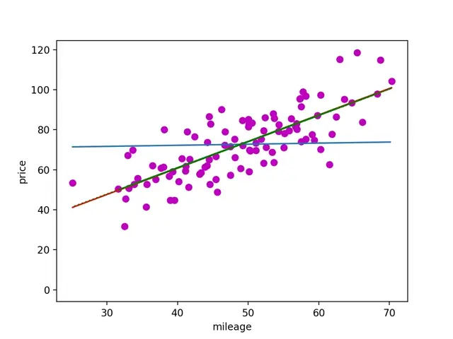

## ft_linear_regression
An introduction to machine learning

### Subject

You will implement a simple linear regression with a single feature - in this case, the
mileage of the car.


<p align="left">
  
</p>

You are also free to use any libraries you want as long as they do not do all the work
for you. For example, the use of python’s numpy.polyfit is considered cheating.

### Usage

```
To train a model using csv run:

    python3 train.py <data.csv>
    
To estimate price run:
    python3 estimatePrice.py

```
### Visuals

Coefficients are saved and used to create an animation. train.py uses gradient descent in training the model.





